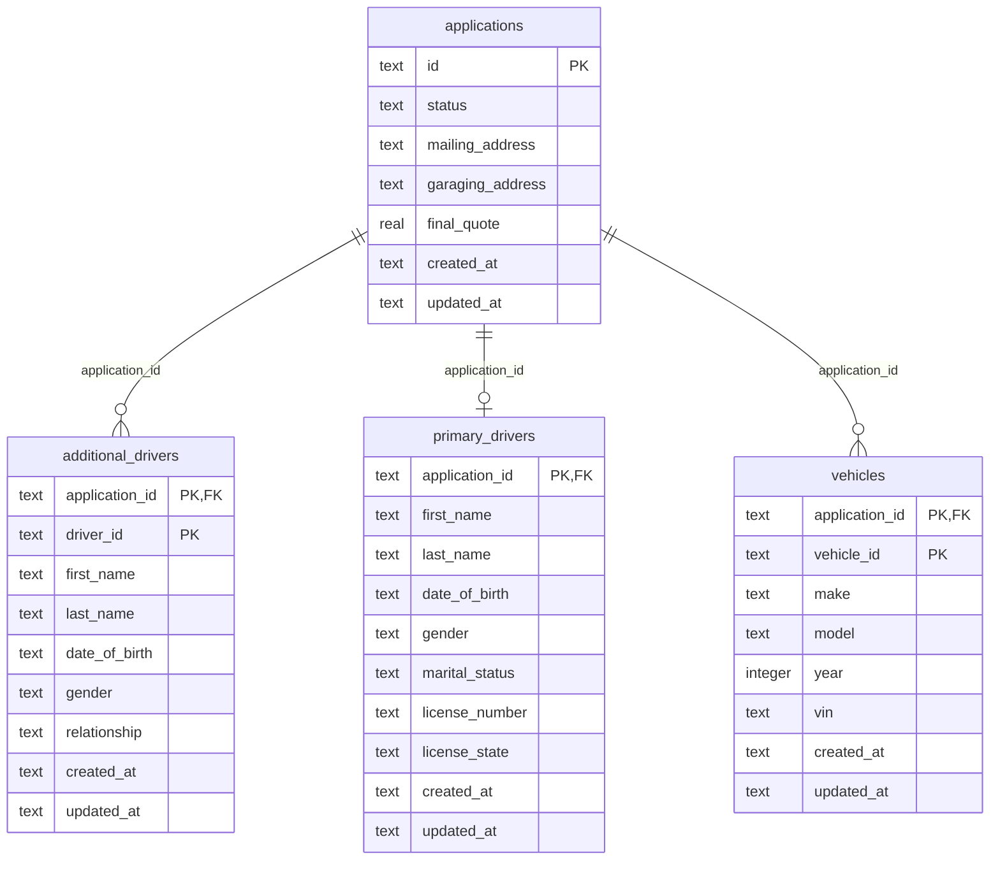

# Data Model

The insurance-quote-api relational schema (SQLite). **Source of truth is `src/db/schema.ts`**; update this file after any schema change.

Column names are the database form (snake_case). Application code sees them camelCased through the Drizzle table definitions.

## Entity-relationship diagram

## Tables

### additional_drivers

| Column | Type | Null | Default | Key |
| --- | --- | --- | --- | --- |
| application_id | text | no |  | PK, FK |
| driver_id | text | no |  | PK |
| first_name | text | yes |  |  |
| last_name | text | yes |  |  |
| date_of_birth | text | yes |  |  |
| gender | text | yes |  |  |
| relationship | text | yes |  |  |
| created_at | text | no |  |  |
| updated_at | text | no |  |  |

- **Primary key:** driver_id, application_id
- **FK:** application_id → applications(id) on delete cascade
- **Check:** `gender IN ('male', 'female', 'non-binary')`
- **Check:** `relationship IN ('spouse', 'child', 'parent', 'sibling', 'other')`

### applications

| Column | Type | Null | Default | Key |
| --- | --- | --- | --- | --- |
| id | text | no |  | PK |
| status | text | no | `started` |  |
| mailing_address | text | yes |  |  |
| garaging_address | text | yes |  |  |
| final_quote | real | yes |  |  |
| created_at | text | no |  |  |
| updated_at | text | no |  |  |

- **Primary key:** id
- **Check:** `status IN ('started', 'submitted')`

### primary_drivers

| Column | Type | Null | Default | Key |
| --- | --- | --- | --- | --- |
| application_id | text | no |  | PK, FK |
| first_name | text | yes |  |  |
| last_name | text | yes |  |  |
| date_of_birth | text | yes |  |  |
| gender | text | yes |  |  |
| marital_status | text | yes |  |  |
| license_number | text | yes |  |  |
| license_state | text | yes |  |  |
| created_at | text | no |  |  |
| updated_at | text | no |  |  |

- **Primary key:** application_id
- **FK:** application_id → applications(id) on delete cascade
- **Check:** `gender IN ('male', 'female', 'non-binary')`
- **Check:** `marital_status IN ('single', 'married', 'divorced', 'widowed')`

### vehicles

| Column | Type | Null | Default | Key |
| --- | --- | --- | --- | --- |
| application_id | text | no |  | PK, FK |
| vehicle_id | text | no |  | PK |
| make | text | yes |  |  |
| model | text | yes |  |  |
| year | integer | yes |  |  |
| vin | text | yes |  |  |
| created_at | text | no |  |  |
| updated_at | text | no |  |  |

- **Primary key:** vehicle_id, application_id
- **FK:** application_id → applications(id) on delete cascade

